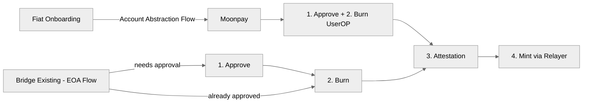

# Injective Bridge CCTP

Tools for bridging USDC between EVM chains with Circle CCTP. The `@injectivelabs/cctp-bridge` package exposes:

- `CctpBridge` for the low-level approve/burn/attest/mint flow
- `BridgeOrchestrator` for a resumable FSM with storage + observers

## Install

```
pnpm add @injectivelabs/cctp-bridge viem permissionless
```

## Flow overview



## Tutorial: CctpBridge (standard EOA)

This flow uses an EOA wallet and mints directly on the destination chain. The attestation step polls Circle and can take a few minutes.

```ts
import { CctpBridge } from "@injectivelabs/cctp-bridge";
import { createWalletClient, http } from "viem";
import { privateKeyToAccount } from "viem/accounts";
import { optimismSepolia, sepolia } from "viem/chains";

async function main() {
  const account = privateKeyToAccount("0x...");
  const walletClient = createWalletClient({
    chain: optimismSepolia,
    transport: http(),
    account,
  });

  const bridge = await CctpBridge.create({
    walletClient,
    srcChain: optimismSepolia,
    destChain: sepolia,
  });

  const approval = await bridge.approveUSDC("1.0");
  if (approval.status === "success") {
    console.log("Approval tx:", approval.transactionHash);
  }

  const burnTx = await bridge.burnUSDC({
    amount: "1.0",
    destinationAddress: account.address,
  });

  const attestation = await bridge.retrieveAttestation({ burnTx });

  const mintTx = await bridge.mintUSDC(attestation);
  console.log("Mint tx:", mintTx);
}

main();
```

## Tutorial: CctpBridge (smart account + relayer mint)

This flow uses a bundler + paymaster for the approve/burn step and a relayer for minting. Provide `ALCHEMY_API_KEY`, `ALCHEMY_POLICY_ID`, and `RELAYER_URL` to supply RPCs, paymaster policy, and relayer endpoint.

```ts
import {
  CctpBridge,
  getAlchemyRpcUrls,
  getPimlicoBundlerRpcUrls,
} from "@injectivelabs/cctp-bridge";
import { createWalletClient, http } from "viem";
import { privateKeyToAccount } from "viem/accounts";
import { optimismSepolia, sepolia } from "viem/chains";

async function main() {
  const account = privateKeyToAccount("0x...");
  const walletClient = createWalletClient({
    chain: optimismSepolia,
    transport: http(),
    account,
  });

  const rpcUrls = getAlchemyRpcUrls({ apiKey: process.env.ALCHEMY_API_KEY! });
  const bundlerRpcUrls = getPimlicoBundlerRpcUrls();

  const bridge = await CctpBridge.create({
    walletClient,
    srcChain: optimismSepolia,
    destChain: sepolia,
    rpcUrls,
    bundlerRpcUrls,
    policyId: process.env.ALCHEMY_POLICY_ID,
    relayerUrl: process.env.RELAYER_URL,
  });

  const userOpHash = await bridge.approveAndBurnUSDCUsingSmartAccount(
    "0.1",
    account.address,
    true,
  );

  const receipt = await bridge.waitForUserOperation(userOpHash, true);
  const attestation = await bridge.retrieveAttestation({
    burnTx: receipt.receipt.transactionHash,
  });

  const mintResult = await bridge.mintUSDCViaRelayer(attestation);
  if (!mintResult.success) {
    throw new Error(mintResult.error);
  }

  console.log("Mint tx:", mintResult.transactionHash);
}

main();
```

## Tutorial: BridgeOrchestrator (resumable FSM)

Use the orchestrator to manage the full flow with state persistence and UI subscriptions. It supports `standard` and `smart-account` modes, plus direct or relayer minting.

```ts
import {
  BridgeOrchestrator,
  BridgeStep,
  LocalStorageRepository,
} from "@injectivelabs/cctp-bridge";

const storage = new LocalStorageRepository();

const orchestrator = await BridgeOrchestrator.create({
  bridge,
  storage,
  params: {
    mode: "standard",
    amount: "1.0",
    destinationAddress: account.address,
    mintMode: "direct",
  },
});

const unsubscribe = orchestrator.subscribe((state) => {
  console.log("Step:", state.step);
});

await orchestrator.execute();

const state = orchestrator.getState();
if (state.step !== BridgeStep.COMPLETED) {
  console.log("Bridge not complete:", state.error);
}

unsubscribe();
```

To resume an in-progress session, call `BridgeOrchestrator.resume` with a session ID and the same storage repository.
Use `MemoryStorageRepository` in server-side or test environments where `localStorage` is unavailable.
