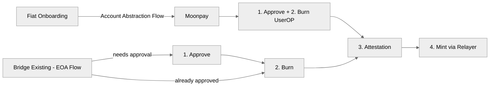

# Injective Bridge CCTP

### Usage

1. Install dependencies

```
pnpm add @inj-sdk/cctp-bridge viem permissionless
```


```mermaid
---
config:
  theme: neutral
---

graph LR
  fiat["Fiat Onboarding"]
  bridge["Bridge Existing - EOA Flow"]
  moonpay["Moonpay"]

  approve["1. Approve"]
  approveAndBurn["1. Approve + 2. Burn UserOP"]
  burn["2. Burn"]
  attest["3. Attestation"]
  mintRelay["4. Mint via Relayer"]

  fiat -->|Account Abstraction Flow| moonpay --> approveAndBurn --> attest --> mintRelay

  bridge -->|needs approval| approve --> burn --> attest
  bridge -->|already approved| burn
```
